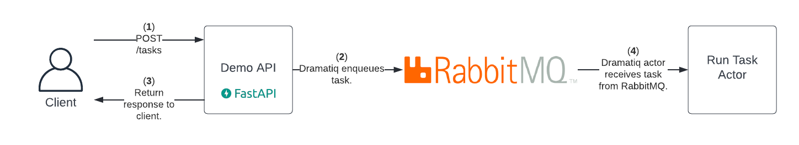

# FastAPI RabbitMQ Dramatiq Demo
 
:wave: Hello and welcome to my demo of using FastAPI, RabbitMQ, and Dramatiq!  In this demo I'm going to show how you can use RabbitMQ and Dramatiq to run tasks in the background asynchronously on a FastAPI app.  Why would you want to do this?  There may be times when you want your api to provide immediate feedback and not have the response wait until the task is completed.  Through [RabbitMQ](https://www.rabbitmq.com/) and [Dramatiq](https://dramatiq.io/) you can accomplish this!  

FastAPI does have the ability out of the box for background tasks, check out the docs [here](https://fastapi.tiangolo.com/tutorial/background-tasks/).  You should only use the builtin option for simple / light tasks.  If you have a resource intensive task or want more features / options (retries, limits, scheduling, etc.) then the RabbitMQ/Dramatiq setup is the way to go.

So what exactly is RabbitMQ and Dramatiq?  RabbitMQ is a message broker; a way for applications, systems, services to communicate with one another and exchange information.  Dramatiq is a python based background task processing library.  Dramatiq has the concept of actors and workers.  When you want to run a function in the background you use a decorator `@dramatiq.actor`.  To call that function and to have it run in the background you append `send()` to the end of it.  The `send()` enqueues the message on RabbitMQ.  A Dramatiq **worker** will receive the message and pass it along the appropriate **actor**.  When you enqueue messages, if you pass along data to the actor, it must be in JSON format.

In this demo I have a basic FastAPI app deployed that has a single endpoint, `/tasks`.  When you make a `POST` to the `/tasks` endpoint the variable `seconds` should be passed in the body.  The client will get an immediate response and a countdown will be performed in the background.  Here is a high level diagram of the demo environment and what's happening behind the scenes when you perform a `POST` to the `/tasks` endpoint:



# Getting Started

Follow these steps to get started and run the demo.

## Prerequisites

To get started make sure you have the following installed on your workstation:

1. [vscode](https://code.visualstudio.com/download)

2. [Docker](https://docs.docker.com/get-docker/)

3. [Docker Compose](https://docs.docker.com/compose/install/) (if not automatically done in the previous step)

4. vcode [Remote Development](https://marketplace.visualstudio.com/items?itemName=ms-vscode-remote.vscode-remote-extensionpack) extension

With these tools installed on your workstation we'll be able to leverage docker compose to spin up two containers, one for the api and another for the rabbitmq.

## Demo Environment

### Bring Up Demo Environment

Once you have the prerequisites met you should now be able to spin up the demo environment.  The first thing you need to do is **clone** down this repo.  Once you have cloned the repo then -> open vscode -> select open folder -> locate the directory you just cloned down -> select open.  

VSCode should automatically recognize that the directory contains a `.devcontainer/` folder and you should see a prompt asking if you'd like to open in a container -> select yes.  If you do not see a prompt, do not worry, you can also open the project within a container by going to the bottom left hand corner of vscode -> click on the green opposite arrow icon -> this should pop open a a dropdown at the top -> select reopen in a container.

After going about either of those methods VSCode should re-open and begin the process of bringing the containers up.  Once the containers are fully up open a new terminal within VSCode and it should drop you into the `api` container.

### Run The Demo

A helper script has been configured to run the demo, from the terminal enter `./entrypoint.sh`.  This will start up the `api` as well as the `dramatiq` workers.  It should look like the following:

```shell
vscode ➜ /workspace (main ✗) $ ./entrypoint.sh
2022-08-08 18:54:33,898 | INFO:    | uvicorn.error - Will watch for changes in these directories: ['/workspace']
2022-08-08 18:54:33,898 | INFO:    | uvicorn.error - Uvicorn running on http://0.0.0.0:5000 (Press CTRL+C to quit)
2022-08-08 18:54:33,899 | INFO:    | uvicorn.error - Started reloader process [518] using WatchFiles
[2022-08-08 18:54:34,528] [PID 520] [MainThread] [dramatiq.MainProcess] [INFO] Dramatiq '1.13.0' is booting up.
[2022-08-08 18:54:34,523] [PID 521] [MainThread] [dramatiq.WorkerProcess(0)] [INFO] Worker process is ready for action.
[2022-08-08 18:54:34,491] [PID 522] [MainThread] [dramatiq.WorkerProcess(1)] [INFO] Worker process is ready for action.
[2022-08-08 18:54:34,417] [PID 523] [MainThread] [dramatiq.WorkerProcess(2)] [INFO] Worker process is ready for action.
[2022-08-08 18:54:34,526] [PID 524] [MainThread] [dramatiq.WorkerProcess(3)] [INFO] Worker process is ready for action.
[2022-08-08 18:54:34,538] [PID 589] [MainThread] [dramatiq.ForkProcess(0)] [INFO] Fork process 'dramatiq.middleware.prometheus:_run_exposition_server' is ready for action.
2022-08-08 18:54:34,876 | INFO:    | uvicorn.error - Started server process [526]
2022-08-08 18:54:34,876 | INFO:    | uvicorn.error - Waiting for application startup.
2022-08-08 18:54:34,877 | INFO:    | uvicorn.error - Application startup complete.
```

Open up your browser and navigate to `http://localhost:5050` and you should see the demo api's OpenAPI docs.  Expand the `/tasks` endpoint -> select Try it out -> edit the seconds var if you'd like (default is 10) -> hit execute.  You'll notice from the OpenAPI docs you get an immediate response back but from the terminal you can see the background task running.  Pretty cool!

```shell
2022-08-08 18:58:33,702 | INFO:    | uvicorn.access - 192.168.32.1:54054 - "POST /tasks HTTP/1.1" 200 OK
2022-08-08 18:58:33.705 | INFO     | app.workers.task:run_task:10 - task recevied!
2022-08-08 18:58:33.705 | INFO     | app.workers.task:run_task:12 - counting down until task completed - seconds: 10
2022-08-08 18:58:34.706 | INFO     | app.workers.task:run_task:12 - counting down until task completed - seconds: 9
2022-08-08 18:58:35.708 | INFO     | app.workers.task:run_task:12 - counting down until task completed - seconds: 8
2022-08-08 18:58:36.709 | INFO     | app.workers.task:run_task:12 - counting down until task completed - seconds: 7
2022-08-08 18:58:37.710 | INFO     | app.workers.task:run_task:12 - counting down until task completed - seconds: 6
2022-08-08 18:58:38.711 | INFO     | app.workers.task:run_task:12 - counting down until task completed - seconds: 5
2022-08-08 18:58:39.713 | INFO     | app.workers.task:run_task:12 - counting down until task completed - seconds: 4
2022-08-08 18:58:40.714 | INFO     | app.workers.task:run_task:12 - counting down until task completed - seconds: 3
2022-08-08 18:58:41.716 | INFO     | app.workers.task:run_task:12 - counting down until task completed - seconds: 2
2022-08-08 18:58:42.717 | INFO     | app.workers.task:run_task:12 - counting down until task completed - seconds: 1
2022-08-08 18:58:43.718 | INFO     | app.workers.task:run_task:14 - task completed!
```

### How Does this all Work?

There are two big things that are happening here that we'll dig into.  First when you send a `POST` to the `/tasks` endpoint we use Dramatiq to enqueue the message onto RabbitMQ.  We then immediately response back to the client while a Dramatiq worker pops the message from the queue and sends it onto the corresponding actor.  

**Enqueing Messages**

When you send a `POST` to the `/tasks` endpoint it will immediately enqueue a message to RabbitMQ to be picked up by a worker.  Let's take a look at where exactly this occurs.  If you look at the [/app/api/tasks.py](https://github.com/briantsaunders/rabbitmq-dramatiq-demo/blob/main/app/api/tasks.py) file you'll see the following:

```python
from fastapi import APIRouter

from app import schemas
from app import actors


router = APIRouter()


@router.post("", response_model=schemas.Task)
def create_task(task_in: schemas.TaskCreate):
    actors.run_task.send(task_in.seconds)
    return {"seconds": task_in.seconds, "status": "submitted"}
```

By appending `send(task_in.seconds)` to `actors.run_task` is what enqueues the message to be picked up by a worker and causes it to be ran in the background.  If you were to remove the `send(task_in.seconds)` and had that line look like `actors.run_task(task_in.seconds)` it would not run that function in the background and the client would not get a response back until the countdown completed.

**Dramatiq Workers**

When you first ran the [entrypoint.sh](https://github.com/briantsaunders/rabbitmq-dramatiq-demo/blob/main/entrypoint.sh) script it did two things:

  1. Ran FastAPI via the [entrypoint_api.sh](https://github.com/briantsaunders/rabbitmq-dramatiq-demo/blob/main/entrypoint_api.sh) script.

  2. Spin up Dramatiq workers via the [entrypoint_dramatiq.sh](https://github.com/briantsaunders/rabbitmq-dramatiq-demo/blob/main/entrypoint_dramatiq.sh) script.

Take a closer look at the `entrypoint_dramatiq.sh` script, when you install Dramatiq it comes with a command line utility called `dramatiq`.  In that `entrypoint_dramatiq.sh` script we're using that command line utility and referencing our `actors/` directory.  This will spin up workers for all functions that have the `@dramatiq.actor` decorator that are registered in the `actors/__init__.py` file.


